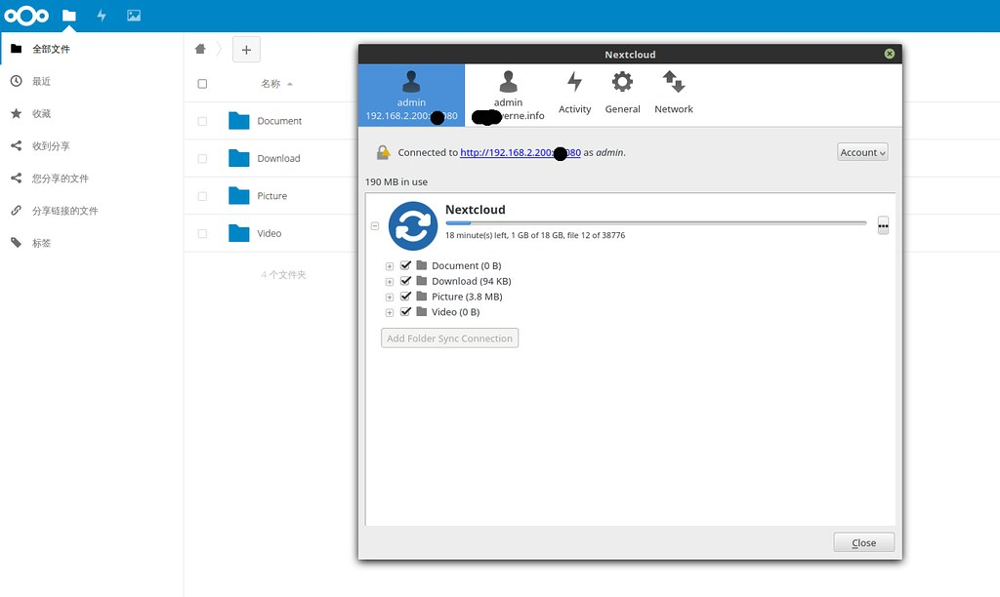

# QNAP笔记

## QNAP系统设置

- 系统 - 常规设置：修改默认的WEB管理端口；时间设为自动获取；
- 系统 - 硬件：修改LED亮度与时间设置；
- 系统 - 智能风扇，调至1000rpm可兼顾散热与噪声；
- 网络&文件服务 - SSH：修改默认端口号；
- 应用服务 - Web服务器：启用Web服务器并修改默认端口号；
- 应用服务 - Web服务器：启用WEBDAV并修改默认端口号；
- 应用服务 - SQL服务器：启用SQL服务器并设置根密码；
- 添加第三方应用商店：
- - 手动下载：https://www.qnapclub.eu/
- - 在应用程序设置中添加第三方源（部分应用搜索不到，用第一种方法）：http://store.qnapclub.eu/store/en.xml
  - 注：第三方应用商店下载链接未加密，可以直接输入地址下载付费应用。


------


## 使用命令行安装 QNAP 的 qpkg 安装包

如果想要给威联通安装一个 qpkg 的安装包时，最直观界面方式就是在 App Center 中，[右上角](https://www.qnap.com/en/how-to/knowledge-base/article/how-to-install-qnap-applications-qpkg-files-manually)，将本地的 `.qpkg` 文件上传到 NAS 并安装。

但是这种方式在外网图形界面加载很慢的情况下是非常难用的，那么这个时候如果能使用命令行安装就非常方便。需要在系统中预先开启 SSH 连接，当然这一步早就做好了。然后使用 ssh 连接登录上。比如下面以安装 Entware [为例](https://github.com/Entware/Entware/wiki/Install-on-QNAP-NAS)：

```shell
wget http://bin.entware.net/other/Entware_1.00std.qpkg
sh Entware_1.00std.qpkg
```

经过这两个步骤就 OK 了。使用 `opkg` 命令可能需要重新登录 NAS SSH。

其他版本的 Entware 可以从[这里](http://pkg.entware.net/binaries/) 获取。

关于什么是 Entware ，可以查看该 [wiki](https://github.com/Entware/Entware/wiki)，一句话概括 Entware 是一个适用于嵌入式系统的软件包库，使用 opkg 包管理系统进行管理。

软件包列表：

- armv5: http://pkg.entware.net/binaries/armv5/Packages.html
- armv7: http://pkg.entware.net/binaries/armv7/Packages.html
- mipsel: http://pkg.entware.net/binaries/mipsel/Packages.html
- x86-32: http://pkg.entware.net/binaries/x86-32/Packages.html
- x86-64: http://pkg.entware.net/binaries/x86-64/Packages.html

需要注意的是安装 Entware 之后很多命令都存放在 `/opt/bin` 目录下，需要修改 `/root` 目录下的 `.bashrc` 文件中的 PATH 来使这些命令被命令行所见。

```bash
export PATH=/opt/bin:$PATH
```


------


## 阿里云DDNS

**0.获取公网ip & 映射端口**

- 我的宽带由电信提供，自带公网ip（如无公网ip打10000（电信）转人工服务索取）；
- 我的光猫型号为**华为EchoLife HS 8145C**，可直接由光猫背面的普通用户账户登陆修改光猫为桥接模式；
- 光猫**lan**口接入路由**wan**口，登陆路由设置pppoe拨号（账号密码可在电信宽带管家公众号获取和修改）；
- 路由控制台开启Upnp，并可手动设置ssh等端口号。

**注：**

- 判断是否为公网ip：连接光猫的无线或将电脑接入猫的lan口，登入光猫管理界面查看wan口ip是否为公网ip；或用路由拨号后登入路由控制台查看wan口ip；
- 若光猫无法设置桥接模式，需**超级管理员**账号登入可获取，账号密码可拨运营商服务号转人工服务查询（*但我打了好几次都说无法查到=。=*）；
- 若可获得超级管理员账号，可由光猫拨号，路由设置为AP模式（此模式下猫lan口接路由lan口），并在光猫上设置路由的DMZ；
- 路由拨号模式下，电信IPTV仍可正常工作。

**1.在阿里云上申请一个域名，并做实名认证；**

**2.实名认证通过后，进行域名解析设置：**


主机记录www的记录值随便填写一个ip地址；

@记录值填写带www的完整域名。

**3.在阿里云个人资料栏下获取或生成AccessKey和Access key Secret**


**4.在QNAP中启用ContainerStation，并SSH至NAS，分别输入下述两串命令：**

```dockerfile
docker pull chenhw2/aliyun-ddns-cli

docker run -d \
    -e "AKID=[ALIYUN's AccessKey-ID]" \
    -e "AKSCT=[ALIYUN's AccessKey-Secret]" \
    -e "DOMAIN=ddns.aliyun.win" \
    -e "REDO=600" \
    chenhw2/aliyun-ddns-cli
```

[ALIYUN's AccessKey-ID]替换成自己的AccessKey，[ALIYUN's AccessKey-Secret]换成Access key Secret，ddns.aliyun.win换成完整域名。

稍后即可使用www.domain.com 或 domain.com 加相应端口号访问自己的NAS了。

**注：**

- 我最先在ContainerStation获取了aliyun-ddns-cli的docker，再用第二行代码设置自己的docker，结果不断提示404错误：<u>UserNotFound  The specified user can not be found.  404  指定用户找不到  根据输入的用户信息找不到该用户。</u>  发现环境变量没有被正确设置。（然后我不会修改docker的环境变量=。=，遂按上述步骤成功完成设置）；

- 若docker控制台显示错误：Status Code: 400 Code: InvalidTimeStamp.Expired Message: Specified time stamp or date value is expired. 将NAS时间设为自动获取即可。

  

------


## Webdav 的使用

### 1. Nextcloud在window 10资源管理器的挂载

> *从Windows Vista起，微软就禁用了http形式的基本WebDAV验证形式（KB841215），必须使用https连接，但是架设在AppFog上的免费账户对SSL证书无权限。所以在Windows Vista/7/8中，要方便地映射NextCloud文件为系统上的“网络位置”，就必须改注册表……*

**0.局域网内，使用 此电脑 - 计算机 - 映射网络驱动器  挂载QNAP文件夹**

**1.开启服务**
		此电脑右键-管理-服务-WebClient 设为自动

**2.修改注册表**

> **a.打开注册表编辑器。**
> 转到**开始 > 运行**。
> 输入 **regedit**。
> 单击确定。
> 如果打开“用户帐户控制”窗口，单击**是**。
> 此时会打开注册表编辑器。
> b.导航到**HKEY_LOCAL_MACHINE\SYSTEM\CurrentControlset\services\WebClient\Parameters**。
> c.选择 **BasicAuthLevel**。
> d.将值改为 **2**。
> e.重新启动计算机。
> f.从 Windows 7 连接到 WebDAV 文件夹。

**3.补充**

> *在某些版本的 Windows 操作系统中，WebDAV 驱动器的最大文件大小被限制为 50MB。如果你试图复制超过 50MB 大小的文件，Windows 就会弹出错误提示框。当然，这个限制是可以通过修改注册表来消除的。将注册表中位于*
> *HKLM\SYSTEM\CurrentControlSet\Services\WebClient\Parameters\FileSizeLimitInBytes*
> *处的键值由 50000000 (50MB) 修改为更大的数值。最大修改为：4294967295（0xffffffff）字节，即4G。*

### 2. Linux挂载

在Linux下可以使用 davfs2 挂载目录。

> 1.安装：**apt install davfs2**
>
> 2.执行命令后系统会自动安装，出现提示，选**是**。
>
> 3.在当前主目录新建一个**webdav**的文件夹，然后使用命令：
>
> ```powershell
> sudo mount -t davfs http://192.168.2.230:81/remote.php/webdav ./webdav/
> ```


------


## 应用推荐

> **Container Station**
>
> **rtorrent-Pro**
>
> **Jellyfin**
>
> **NextCloud**


------


## Container Station：docker本地环境

威联通上有一个 Container Station 的应用，可以直接用官方的 App Center 中下载安装，这其实就是一个 Docker 本地环境，如果[熟悉 Docker](https://blog.einverne.info/post/2017/07/docker-introduction.html) 使用，那么其实都直接可以 ssh 登录 NAS 然后完全使用命令行来操作。但威联通提供了一个直观的界面。


------


## rtorrent-Pro：PT下载器


## Jellyfin：影音中心


## NextCloud：个人云盘

### 1. 两种安装方式：

- 应用商店的APP（付费）
- Docker安装

### 2. 应用商店NextCloud

- [Apache73](https://cdn.qnapclub.eu/qpkg_artifacts/apache73_2441.7313_x86_64/apache73_2441.7313_x86_64.qpkg) ： https://www.qnapclub.eu/en/qpkg/735
- [nextcloud73](https://www.qnapclub.eu/en/qpkg/750)

#### 安装步骤简述如下：

- 手动安装nextcloud73与Apache73

- 开启Apache与NextCloud应用

- 填写管理员并配置数据库

- > 选择使用 NAS 宿主机的 SQL 服务，可以方便的使用 phpMyAdmin 来管理。NAS 上 MySQL 服务端口在 应用服务 设置栏可以找到

#### 安全及设置警告

在 `用户名 - 管理 - 概览`  下运行安全检查，并作相应的设置


#### 添加信任域名

编辑`/share/CACHEDEV1_DATA/.qpkg/NextCloud/nextcloud/config/config.php`文件，添加信任域名（局域网ip以及解析域名带端口号）：

```php
<?php
$CONFIG = array (
  'instanceid' => 'xxxxxxxx',
  'passwordsalt' => 'xxxxxxxx',
  'secret' => 'xxxxxxxx',
  'trusted_domains' =>
  array (
    0 => '192.168.1.101:xxx',
    1 => 'domain.com:xxx',
    2 => 'www.domain.com:xxx',
    3 => '192.168.2.1:xxx',
  ),
  'datadirfctory' => '/share/CACHEDEV1_DATA/.qpkg/NextCloud/nextcloud/data',
  'dbtype' => 'mysql',
  'version' => '17.0.1.1',
  'overwrite.cli.url' => 'http://192.168.3.103:xxx',
  'dbname' => 'nextcloud',
  'dbhost' => 'localhost:xxxx',
  'dbport' => '',
  'dbtableprefix' => 'oc_',
  'dbuser' => 'xxxxxxxxxx',
  'dbpassword' => 'xxxxxxxxxxxx',
  'installed' => true,
  'maintenance' => false,
);
```

#### 配置Apache

使用一段时间后发现NexctCloud占用内存极大，貌似无法正常释放内存，修改apache配置解决

使用`find / -name 'http.conf'`找到NextCloud的配置文件（`/share/CACHEDEV1_DATA/.qpkg/NextCloud/httpd.conf`）做如下编辑：

```json
LoadModule mpm_prefork_module libexec/mod_mpm_prefork.so

#一般linux默认使用的是prefork ，windows的是winnt。

#Server-pool management (MPM specific)
Include etc/extra/httpd-mpm.conf		

#开启MPM模块
```

使用`find / -name 'http-mpm.conf'`找到apache的配置文件（`/share/CACHEDEV1_DATA/.qpkg/Qapache/etc/extra/httpd-mpm.conf`）做如下编辑：

```json
# prefork MPM
# StartServers: number of server processes to start
# MinSpareServers: minimum number of server processes which are kept spare
# MaxSpareServers: maximum number of server processes which are kept spare
# MaxRequestWorkers: maximum number of server processes allowed to start
# MaxConnectionsPerChild: maximum number of connections a server process serves
#                         before terminating
<IfModule mpm_prefork_module>
    StartServers             4
    MinSpareServers          2
    MaxSpareServers          5
    MaxRequestWorkers      250
    MaxConnectionsPerChild  50
</IfModule>


```

> 附机器配置做参考：j3455+10G内存

找到`httpd-default.conf`，修改KeepAlive设置

```json
KeepAlive On
```

重启Qapache与NextCloud使设置生效。

##### 参考资料：

>  [apache占用内存高解决办法](https://www.cnblogs.com/xiaoleiel/p/8308418.html)
>
> 我用512M的vps，访问量不大，但内存占用很大，甚至宕机。
>
> 我用top，然后shitf+m发现，httpd占用内存极大。经过网上找资料设置后，用过一段时间终于没再出现内存问题了。
>
> 首先查找配置文件的位置，可以用如下命令：
>
> find / -name httpd.conf
> 找到配置文件/usr/local/apache/conf/extra/httpd-mpm.conf，修改设置Apache MPM Prefork模块
>
> StartServers 3
> MinSpareServers 2
> MaxSpareServers 5
> ServerLimit 256
> MaxClients 256
> MaxRequestsPerChild 40
>
> 我原来的MaxRequestsPerChild是为0，问题应该在此。
>
> StartServers设置了服务器启动时建立的子进程数量
> MinSpareservers和MaxSpareServers分别设置空闲子进程的最小和最大数量
>
> ServerLimit则是控制MaxClients所能使用的最大值。缩减MaxClients能让运行动态内容（比如：WordPress）的服务器有很大的改变。如果你的VPS遭遇到流量的大幅增加，而你的MaxClients设置的太高的话，你的服务器将会无限循环工作于从物理内存交换页面到虚拟内存中，最终导致宕机。一般计算适当的MaxClients值取决于你总共可用的系统内存除于每个Apache进程使用的内存。例如，如果你还有500MB的内存可用于Apache，每个Apache进程大约使用20MB的内存，你可以设置你的MaxClients为（512-12）/ 10 = 50（这个计算好像原文中有误）。使用命令top可以得到你VPS实时内存的使用。
>
> MaxRequestsPerChild这个指令设定一个独立的子进程将能处理的请求数量。在处理“MaxRequestsPerChild 数字”个请求之后，子进程将会被父进程终止，这时候子进程佔用的内存就会释放，如果再有访问请求，父进程会重新产生子进程进行处理。如果 MaxRequestsPerChild预设为0(无限)或较大的数字(例如10000以上)可以使每个子进程处理更多的请求，不会因为不断终止、启动子进程降低访问效率，但MaxRequestsPerChild设置为0时，如果佔用了200～300M内存，即使负载下来时佔用的内存也不会减少。内存较大的服务器可以设置为0或较大的数字。内存较小的服务器不妨设置成50、100、200，以防内存溢出。
>
> 找到配置文件/usr/local/apache/conf/extra/httpd-default.conf，修改KeepAlive设置
>
> ```
> # Timeout: The number of seconds before receives and sends time out.#Timeout 30## KeepAlive: Whether or not to allow persistent connections (more than# one request per connection). Set to “Off” to deactivate.#KeepAlive On## MaxKeepAliveRequests: The maximum number of requests to allow# during a persistent connection. Set to 0 to allow an unlimited amount.# We recommend you leave this number high, for maximum performance.#MaxKeepAliveRequests 120## KeepAliveTimeout: Number of seconds to wait for the next request from the# same client on the same connection.#KeepAliveTimeout 5
> ```
>
> Timeout是一个连接多少时间后断开，这个参数设置在30-60是一般的php程序都是适用的，至少要运行一些要占用大量时间的php程序，那么适当调高也是可以的，但请不要太高，否则会影响apache性能，本次优化我们使用30就很足够了。
>
> MaxKeepAliveRequests 是一个连接最大的请求量，对于页面有较多的图片等元素，可以适当调高一点，对于一般的网页设置在80-120是足够的，我们就设置为120，如果设置太高会导致httpd长时间不能退出释放内存的。
>
> KeepAliveTimeout 是当用户处理一次连接时，如果在该参数的时间内还有请求则会继续执行，不需要重新创建新的连接，直到达到MaxKeepAliveRequests的最大值才会退出。对于perfork模式下的，有人认为是将KeepAlive Off会比较好，但是对于绝大多数的网站都会不多不少有些图片元素，所以将该项打开，并将KeepTimeOut设置在2-5秒，不但有效提高服务器性能，也能加快页面打开速度。
>
> 如果还需要优化可以考虑修改启动的模块，Wordpress主要使用以下模块，保留这些其他的可以注释掉
>
> LoadModule authz_host_module modules/mod_authz_host.so
> LoadModule log_config_module modules/mod_log_config.so
> LoadModule expires_module modules/mod_expires.so
> LoadModule deflate_module modules/mod_deflate.so
> LoadModule headers_module modules/mod_headers.so
> LoadModule setenvif_module modules/mod_setenvif.so
> LoadModule mime_module modules/mod_mime.so
> LoadModule autoindex_module modules/mod_autoindex.so
> LoadModule dir_module modules/mod_dir.so
> LoadModule alias_module modules/mod_alias.so
> LoadModule rewrite_module modules/mod_rewrite.so
> LoadModule negotiation_module modules/mod_negotiation.so

### 3. 使用Docker安装NextCloud

引自[Verne](https://blog.einverne.info/post/2018/06/qnap-file-sync.html)

> 在 Container Station 中安装 NextCloud 相对比较容易，如果熟悉 Docker 可以直接使用 Docker Compose 文件，如果不熟悉，那直接使用 GUI 也比较方便。
>
> 安装步骤简单描述如下：
>
> 1. 打开 Container Station ，选择**创建**，然后搜索 nextcloud，选择 **Docker Hub**
> 2. 安装官方提供的 NextCloud 镜像。 注：以上两步可以简化为 ssh 登陆后 `docker pull nextcloud`， 如果熟悉命令行推荐使用命令行下载避免界面可能出现的各种奇怪问题
> 3. 等待镜像下载完成，选择从镜像创建容器
> 4. 修改名字为 “nextcloud”，CPU 内存等配置自己选择
> 5. 高级设置中，网络选择 NAT 模式，并且在下方选择一个合适的端口，比如 20080，这样以后访问 NAS 该端口就转发到 Docker 80 端口
> 6. 设置共享文件夹，如果使用 docker 默认的 volume ，那么会存储在一个很深的目录中，这里我选择挂载本机共享文件夹，这边到 File Station 中创建一个共享文件夹 NextCloud（注意给予其他用户访问权限），然后回到设置，新增挂载，然后本地路径选择刚刚创建的共享文件夹，然后挂载路径填写 `/var/www/html`
> 7. 完成创建。稍等片刻就会发现 NextCloud 共享文件夹中多出了很多容器的文件，其中 NextCloud 之后会同步的文件也在其中。
>
> 完成容器的创建之后，需要首次登录配置，在容器成功运行之后，在界面中会出现一个链接，http://:20080 这样的形式，点击进入，如果一切都没问题，这边应该会出现 NextCloud 首次安装的配置，需要创建管理员和连接数据库。
>
> 这边我选择使用 NAS 宿主机的 MySQL 服务，而不像[之前使用 Docker Compose 那样](https://github.com/einverne/dockerfile) 使用 MySQL 容器，主要是 NAS 上可以方便的使用 phpMyAdmin 来管理。NAS 上 MySQL 服务端口 3306。然后还需要注意的一个配置是，在 Container Station 属性，网络属性中有一个桥接地址，该配置为 Docker 容器提供网络访问，记住这边的网关比如我的是 10.0.3.1
>
> 在 NextCloud 容器运行成功之后也可以通过在命令行中使用 `docker inspect nextcloud` 然后查看 **Gateway** 地址 `docker inspect nextcloud | grep "Gateway"` 来查看 Docker 容器的网络配置。
>
> 在 Docker 中连接宿主机 MySQL 时需要特别注意，这个时候不能使用 `localhost` 或者 `127.0.0.1`，因为这个时候 `localhost` 或者 `127.0.0.1` 会指向 Docker 容器本地的地址，需要换成宿主机，比如这里 NAS 的地址，也就是容器的网关地址，比如我这边上面查看得到的 `10.0.3.1`
>
> 填写 NextCloud 配置之前，在 phpMyAdmin 中先创建 nextcloud 用户和 nextcloud 数据库，记住用户名密码，然后在网页中的配置中填写，然后数据库地址一定需要填写 `10.0.3.1:3306` ，这边一定要记住使用容器 Gateway 地址。
>
> 选择 NextCloud 的一大原因就是因为 NextCloud 的跨平台支持太棒了，所有的平台都有非常好用的客户端。
>
> 下面是我的 Mint 上客户端和网页中同步的内容，局域网中速度还是很快的。
>
> [](https://farm2.staticflickr.com/1785/28001578967_f25d1c5179_b.jpg)
>
> 或者如果熟悉 compose 也可以使用
>
> ```json
> version: "3"
> services:
>   nextcloud:
>     image: nextcloud:apache
>     container_name: nextcloud
>     restart: always
>     ports:
>       - 20080:80
>     volumes:
>       - /share/NextCloud:/var/www/html
> ```
>
> 确保 `/share/NextCloud` 也就是 NextCloud 共享文件夹以及创建


------


## Transmission 下载 BT（备用）

引自 [Ein Verne](https://blog.einverne.info/post/2018/06/qnap-transmission.html)

这一篇讲在威联通上安装和使用下载工具 – Transmission。

[Transmission](https://transmissionbt.com/) 是一个 BT 客户端，提供了 Web 和命令行界面，非常适合在威联通机子上跑。威联通自身的 Download Station 根本无法用，而迅雷和百度也基本无法用。只能尝试一下这个方法了。

### 安装

如果看过之前的文章，应该知道威联通第三方的应用市场 QNAP CLUB，在其中直接能够找到 QTransmission。安装完成之后用户名密码是 qnap 和 qnap。

配置文件路径：

- `/opt/QTransmission/etc`
- `/share/CACHEDEV1_DATA/.qpkg/QTransmission/etc`

为什么有两个路径呢，是因为 opt 目录下的路径其实是一个软链接，指向真实在 `/share/CACHEDEV1_DATA/.qpkg/QTransmission` 的目录。

如果要修改 WEB 界面的端口，需要同时修改 `/mnt/HDA_ROOT/.config/qpkg.conf` 里面 QTransmission 配置的端口。

### 配置

安装完成后直接在威联通 WEB 界面上点击进入，然后使用 qnap - qnap 登录。设置限速、关闭 DHT，然后在路由器上做端口转发，保证 51413 端口开放。

使用 vi 修改配置 `vi /share/CACHEDEV1_DATA/.qpkg/QTransmission/etc/settings.json`，需要注意的是在修改配置的时候，停用 QTransmission，否则再启用 QTransmission 就会恢复到默认配置。

其他常用的配置

```json
"cache-size-mb": 16
```

然后在威联通中新建共享文件夹，配置下载保存的位置。

```shell
"download-dir": "/share/Transmission"
```

等等。

配置详解见文末。

### 启动脚本

默认情况下可以尝试使用如下命令来启动和停止。

```shell
/etc/init.d/QTransmission.sh start
/etc/init.d/QTransmission.sh stop
```

### 问题

如果启动之后 51413 端口在界面上依然显示无法连接，可以尝试等待一段时间再试试。我的实际测试情况是界面上无法连接，但是实际还是能够正常工作。

#### 配置监听文件夹自动下载

在配置中：

```json
"watch-dir": "/share/bt",  # 监听文件夹目录
"watch-dir-enabled": true # 是否监听文件夹
```

即可

#### 远程控制

配合 Android 上的 Transdroid 使用，需要开启远程访问控制，如果有固定的访问 IP 段，可以对应的配置，直接禁用下面两个白名单危险系数较高，慎重：

```json
"rpc-whitelist-enabled": false,
"rpc-host-whitelist-enabled": false,
```

### Transmission 配置详解

打开 Transmission 的配置能看到非常多的配置选项，这里列举一下重要的配置：

```json
"alt-speed-up": 500, # 限速时段上传限速值
"alt-speed-down": 500, # 限速时段下载限速值
"alt-speed-enabled": false,
"alt-speed-time-begin": 540,
"alt-speed-time-day": 127, # 时段限速日期（星期几），127 表示每天，更复杂配置参考官网。用 7 位二进制数表示，然后转换成十进制数，0000001 表示周日，1000000 表示周六，0000010 表示周一，0000100 表示周二。如果你只要在周末限速，该数应该 1000001，转换为十进制就是 65
"alt-speed-time-enabled": true, # 启用限速，为 false 时，以上计划配置则不生效，生效时会自动禁用 alt-speed-enabled 配置，二者只能选一个
"alt-speed-time-end": 420, # 限速时段结束时间，这个配置表示的是凌晨零点到开始时间的分钟数，比如 7:00 就是 7*60=420。需要注意的是，该时间是用的 GMT 时间，即北京时间 -8 小时。比如你计划北京时间 7 点 30 分开始，这个数字应该是（7-8+24）*60+30=1410
"bind-address-ipv4": "0.0.0.0", # IPv4 地址绑定，一般不要改动
"bind-address-ipv6": "::", #IPv6 地址绑定，一般不要改动
"blocklist-enabled": true, # 启动白名单，默认不启动，需要启动改为 true
"blocklist-updates-enabled": false,
"blocklist-url": "http://www.example.com/blocklist",
"cache-size-mb": 4, #缓存大小，以 MB 为单位，建议设大一些，避免频繁读写硬盘而伤硬盘，建议设为内存大小的 1/6～1/4
"compact-view": false,
"dht-enabled": false, #关闭 DHT（不通过 tracker 寻找节点）功能，不少 PT 站的要求，但 BT 下载设置为 true 会使得下载更好
"download-dir": "/share/Downloads", #下载的内容存放的目录
"download-queue-enabled": true,
"download-queue-size": 5,
"encryption": 1, # 加密。指定节点的加密模式，默认 1。0 表示关闭 , 0= 不加密，1= 优先加密，2= 必须加密
"lazy-bitfield-enabled": true, # 默认为 true，设置为 true 时可以避免某些 ISP 通过查询完整位段来屏蔽 BT，从而破解部分 ISP 对 BT 的封杀，当然不一定完全有效
"idle-seeding-limit": 30,
"idle-seeding-limit-enabled": false,
"incomplete-dir": "/share/Downloads",  # 临时文件路径
"incomplete-dir-enabled": false,
"inhibit-desktop-hibernation": true,
"lpd-enabled": false, #禁用 LDP（本地节点发现，用于在本地网络寻找节点）, 不少 PT 站的要求
"main-window-height": 500,
"main-window-is-maximized": 0,
"main-window-width": 615,
"main-window-x": 337,
"main-window-y": 211,
"message-level": 2,
"open-dialog-dir": "/share/Download",  # 网页对话框打开的根目录
"peer-congestion-algorithm": "",
"peer-limit-global": 240, # 全局连接数
"peer-limit-per-torrent": 60, # 每个种子最多的连接数
"peer-port": 51413, # 传入端口，预设的 port 口
"peer-port-random-high": 65535, # 传入端口随机值范围上限
"peer-port-random-low": 49152, # 传入端口随机值范围下限
"peer-port-random-on-start": false, # 启用随机端口，默认关闭，不建议改为 true
"peer-socket-tos": "default",
"pex-enabled": false, # 是否启用用户交换，默认为 true，关于 PEX，有兴趣的朋友可参考 http://en.wikipedia.org/wiki/Peer_exchange，对于只用 PT 的朋友，可以设为 false, 禁用 PEX（节点交换，用于同已与您相连接的节点交换节点名单）, 不少 PT 站的要求
"port-forwarding-enabled": true, # 启用端口转发（uPnP），如果路由支持并且也开启了 uPnP，则路由会自动做端口映射，但是需要注意的是如果内网有几台机器同时使用 transmission，就必须更改 peer-port 值为不一样
"preallocation": 1, # 预分配文件磁盘空间，0= 关闭，1= 快速，2= 完全。建议取 1 开启该功能，防止下载大半了才发现磁盘不够。取 2 时，可以减少磁盘碎片，但速度较慢。
"prefetch-enabled": 1,
"queue-stalled-enabled": true,
"queue-stalled-minutes": 30,
"ratio-limit": 2, # 分享率限制
"ratio-limit-enabled": false, # 启用分享率限制，默认不启用
"rename-partial-files": true, #在未完成的文件名后添加后缀.part,false= 禁用
"rpc-authentication-required": true, # 远程控制需要验证，默认为需要
"rpc-bind-address": "0.0.0.0", # 远程控制地址绑定，允许 IP 通过 RPC 访问，默认值表示任何地址都可以访问
"rpc-enabled": true, # 启用远程控制，默认启用
"rpc-host-whitelist-enabled": true, # 是否开启主机白名单
"rpc-host-whitelist": "", # 白名单，如果需要远程访问，最好配置
"rpc-password": "{cxxxxxxxxxxxxxxxxxxxxxxxxxxxxxxxxxxxxxxxxxxxxxxaE", #web-ui 的密码，可直接修改，重新运行或者 reload 服务的时候密码会自动 HASH 增加安全性
"rpc-port": 9091, # 默认 web-ui 的 port 口，也是远程控制端口，可自行更改
"rpc-url": "/transmission/",
"rpc-username": "transmission", #默认登入名称，也是远程控制用户名
"rpc-whitelist": "127.0.0.1", # 远程控制白名单，默认值为所有地址，支持通配符*，如 192.168.2.*
"rpc-whitelist-enabled": true, # 启用远程控制白名单，如果启用，则仅仅上面列出的地址可以远程连接
"scrape-paused-torrents-enabled": true,
"script-torrent-done-enabled": false,
"script-torrent-done-filename": "/home/",
"seed-queue-enabled": false,
"seed-queue-size": 10,
"show-backup-trackers": true,
"show-extra-peer-details": false,
"show-filterbar": true,
"show-notification-area-icon": false,
"show-options-window": true,
"show-statusbar": true,
"show-toolbar": true,
"show-tracker-scrapes": true,
"sort-mode": "sort-by-age",
"sort-reversed": false,
"speed-limit-down": 300, #平时的下载限速
"speed-limit-down-enabled": true, #启用平时下载限速
"speed-limit-up": 30, #平时上传限速
"speed-limit-up-enabled": true, #启用平时上传限速
"start-added-torrents": false,
"statusbar-stats": "total-ratio",
"torrent-added-notification-enabled": true,
"torrent-complete-notification-enabled": true,
"torrent-complete-sound-enabled": true,
"trash-can-enabled": true,
"trash-original-torrent-files": false,
"umask": 18,
"upload-slots-per-torrent": 14
"utp-enabled": true, #启用μTP 协议
"watch-dir": "/share/bt",  # 监听文件夹目录
"watch-dir-enabled": false # 是否监听文件夹
```

跟多的详细配置可以参考官网[文档](https://github.com/transmission/transmission/wiki/Editing-Configuration-Files)